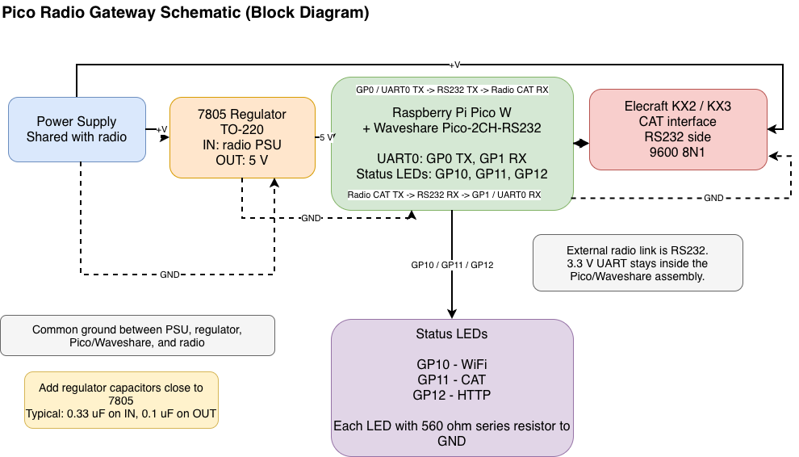

# KX2/KX3 Pico W Reporter

This project is a MicroPython application for a Raspberry Pi Pico W that connects an Elecraft KX2 or KX3 radio to a web endpoint.

After boot, the Pico W:

- scans for a known Wi-Fi network from `config.py`
- connects to the first matching network it finds
- opens CAT communication with the KX2 or KX3 over UART
- polls the radio every 2 seconds for frequency and mode
- sends the current state to the configured web URL as an HTTP `POST` request

The request body is JSON and currently contains these fields:

- `freq`: radio frequency in kHz with two decimal places
- `mode`: operating mode derived from the radio CAT mode code

Each request also includes an `Authorization` header in Bearer format:

```text
Authorization: Bearer <HTTP_API_KEY>
```

Example JSON body:

```json
{
  "freq": "7025.00",
  "mode": "CW"
}
```

If the HTTPS request fails, the application retries once using the fallback HTTP URL from `config.py`.

## Hardware

- Board: Raspberry Pi Pico W / Pico WH
- Radio: Elecraft KX2 or KX3
- Radio link: TTL UART at 9600 8N1
- UART pins:
  - `GP0` = TX
  - `GP1` = RX
- LED pins:
  - `GP10` = Wi-Fi status
  - `GP11` = CAT status
  - `GP12` = HTTP status

The radio side must use TTL-level CAT signaling, not RS-232.

## LED behavior

- Wi-Fi LED blinks while scanning or connecting, then stays on after Wi-Fi connects.
- CAT LED blinks while probing CAT communication, then stays on after the radio responds correctly.
- HTTP LED blinks once for a successful request and twice for an error.

## Runtime behavior

The application uses a simple state machine:

1. `WIFI_CONNECT`
2. `CAT_CONNECT`
3. `RUN`

In `RUN`, it reads:

- `FA;` for frequency
- `MD;` for mode

If Wi-Fi drops, it returns to Wi-Fi reconnect mode. If CAT reads fail, it returns to CAT reconnect mode. HTTP failures are logged and the main loop continues running.

## Files

- `main.py`: application state machine, LEDs, Wi-Fi handling, UART polling, HTTP sending
- `kx2.py`: small CAT helpers for reading frequency and mode from KX2/KX3 CAT
- `config.py`: Wi-Fi list, URLs, pins, UART settings, timeouts, debug flags
- `SPEC.md`: original project specification

## Configuration

Edit `config.py` to set:

- known Wi-Fi networks
- primary and fallback server URLs
- API key used in the Bearer authorization header
- UART pins and baud rate
- LED pins
- retry intervals and poll interval
- debug flags

## Deployment

Copy `main.py`, `kx2.py`, and `config.py` to the Pico W running MicroPython. The program is designed to start from `main.py` and run continuously.

## Web Example

The `web` directory contains two simple PHP examples showing how a server can receive and return the data sent by the Pico W:

- `web/radio-upload.php`: accepts a `POST` request with a JSON body, checks the Bearer token, adds `last_seen` with the current server timestamp, and stores the result into `radio.json`
- `web/radio-json.php`: reads `radio.json` and returns it as JSON, with a small default response if the file does not exist yet

These files are useful as a minimal reference implementation for storing the latest `freq` and `mode` values on a web server and making them available to another client. The server adds the `last_seen` timestamp when it saves the record. The API key in `web/radio-upload.php` must match `HTTP_API_KEY` in `config.py`.

## Debug

Two small helper scripts are included for UART debugging:

- `uart_listen_test.py`: receive-only listener for checking whether the Pico can see data arriving on `GP1`. It prints buffered UART data every 500 ms, so it is useful when verifying wiring, baud rate, and whether the radio is transmitting anything at all. The script expects radio TX -> Pico `GP1` and shared ground. No Pico TX connection is needed.
- `uart_loopback_test.py`: local UART self-test for the Pico. It sends `PING...` messages from `GP0` and expects to read them back on `GP1`, so it helps confirm that the Pico UART, pins, and basic serial configuration work before involving the radio. To use it, connect `GP0` directly to `GP1` and reset the board.

These two files were especially useful during early bring-up because they separate "is the Pico UART working?" from "is the radio CAT link working?".

## Schematic


